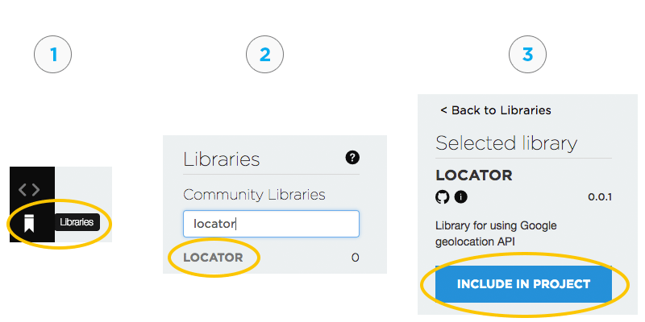

# Locator

The locator is a combination of library and webhook to make it easy to get a location based on Wi-Fi or cellular tower information via the [Google Geolocation API](https://developers.google.com/maps/documentation/geolocation/intro).

This is not a substitute for GPS; it's a mainly a quick and easy way to figure out approximately where you are. You should only expect accuracy within 4000 or so meters, so a couple miles, or what town you're in, not which street you're on. 

In experimental testing, however, it appears to be much more accurate in cities where there are many cellular towers. Also, Wi-Fi locations tend to be very accurate when available, though they are not always available.

## Get Started

In order to start collecting device location, you will need to do the following:

1) Get a [Google API Key](#getting-a-google-api-key)
2) Flash your device with the [locator firmware library](#writing-device-firmware)
3) [Create a webhook](#creating-a-webhook) that gets the device's location from the visible networks

## Getting a Google API Key

In order to use the API you will need to get a [Google Location API Key](https://developers.google.com/maps/documentation/geolocation/get-api-key). 

This key is entered into your webhook to authentication your location requests.

## Writing Device Firmware

The easiest way to get started is to use Particle Web IDE or Particle Local IDE and select the **locator** library from the community library and use the provided example. To get started using the Web IDE, visit https://build.particle.io, and follow the steps below to import the location library into your project.



1) Click on the Libraries icon in the side bar
2) Find the "Locator" library and click on it
3) Click the "Include in Project" button to add it to your firmware application 

Once the library has been imported, paste in the following code:

```
#include "locator.h"

Locator locator;

SYSTEM_THREAD(ENABLED);

void setup() {
	Serial.begin(9600);
	locator.withLocatePeriodic(120);
}

void loop() {
	locator.loop();
}

```

That program works on both the Electron and Photon (and P1). It requires system firmware 0.6.0 or later.

The calls are described in the **Firmware Library API** section below.

## Creating a Webhook

This is the JSON for the integration. Make sure you update where it says `PASTE_YOUR_GOOGLE_API_KEY_HERE`!

```
{
	"name": "Manual geolocation test",
	"event": "deviceLocator",
	"url": "https://www.googleapis.com/geolocation/v1/geolocate",
	"requestType": "POST",
	"mydevices": true,
	"noDefaults": true,
	"query": {
		"key": "PASTE_YOUR_GOOGLE_API_KEY_HERE"
	},
	"headers": {
		"Content-Type": "application/json"
	},
	"body": "{ {{#c}}\"considerIp\":false,\"radioType\": \"lte\",\"carrier\": \"{{o}}\",\"cellTowers\":[{{#a}}{\"cellId\":{{i}},\"locationAreaCode\":{{l}},\"mobileCountryCode\":{{c}},\"mobileNetworkCode\":{{n}} },{{/a}}{\"cellId\":{{a.0.i}},\"locationAreaCode\":{{a.0.l}},\"mobileCountryCode\":{{a.0.c}},\"mobileNetworkCode\":{{a.0.n}} }]{{/c}}{{#w}}\"considerIp\":{{i}},\"wifiAccessPoints\":[{{#a}}{\"macAddress\":\"{{m}}\",\"signalStrength\":{{s}},\"channel\":{{c}} },{{/a}}{\"macAddress\":\"{{a.0.m}}\",\"signalStrength\":{{a.0.s}},\"channel\":{{a.0.c}} }]{{/w}} }",
	"responseTemplate": "{{^error}}{{location.lat}},{{location.lng}},{{accuracy}}{{/error}}{{#error}}{{message}}{{/error}}",
	"responseTopic": "hook-response/{{PARTICLE_EVENT_NAME}}/{{PARTICLE_DEVICE_ID}}"
}
```

To create this using the console:

- Open the Integrations tab
- Create a new Integration of type Webhook (not Google Maps Device locator!)
- Click on the Custom Template option
- Paste in the JSON above (with your API key)


## Testing

Viewing the Event Log in the [Particle Console](https://console.particle.io) is the easiest way to watch the code in action.

The *deviceLocator* event contains the information about the tower(s) where you currently are located. For example:

```
{"c":{"o":"AT&T","a":[{"i":145073610,"l":11511,"c":310,"n":410}]}}
```

Then you'll see a *hook-sent/deviceLocator* event. The data is always *undefined*; that is the normal behavior.

Finally, you should hopefully get `hook-response/deviceLocator` event with something like:

```
42.3857729,-75.195375,4737
```
This response contains the location of the device, broken down into three comma-separated values:
- **Latitude**: The latitude of the device's location
- **Longitude**: The longitude of the device's location
- **Circle of Uncertainty**: The radius in meters that represents the uncertainty range of the reported location 


## Firmware Library API

### Operating modes

There are three modes of operation:

If you want to only publish the location once when the device starts up, use withLocateOnce from your setup function.

```
locator.withLocateOnce();
```

To publish every *n* seconds while connected to the cloud, use withLocatePeriodic. The value is in seconds.

```
locator.withLocatePeriodic(120);
```

To manually connect, specify neither option and call publishLocation when you want to publish the location

```
locator.publishLocation();
```

### The loop

With periodic and locate once modes, you must call 

```
locator.loop();
```

from your loop. It doesn't hurt to always call it, even in manual location mode. It gives the library time to process the data.

### Customizing the event name

The default event name is **eventLocator**. You can change that in setup using:

```
locator.withEventName("myEventName");
```

This also must be updated in the webhook, since the eventName is what triggers the webhook. 

### Subscription

You can also have the library tell your firmware code what location was found. Use the withSubscribe option with a callback function.

This goes in setup() for example:

```
locator.withSubscribe(locationCallback).withLocatePeriodic(120);
```

The callback function looks like this:

```
void locationCallback(float lat, float lon, float accuracy)
```

One possibility is that you could display this information on a small OLED display, for example.

### Debugging

The library uses the logging feature of system firmware 0.6.0 or later. Adding this line to the top of your .ino file will enable debugging messages to the serial port.

```
SerialLogHandler logHandler;
```

## Examples

Here are some examples. I was driving and not all of the measurements were taken at the same time, but it provides a good overview of the accuracy.

### Example 1


In this map, point 1 and point 2 are GPS locations taken at different times.

Point W is a Wi-Fi location, which tends to be quite accurate.

Point C is a cellular location, which was accurate but the circle of uncertainty (blue) is large.

### Example 2


Point T and the blue circle of uncertainty is a cellular location from T-Mobile using 2G.

Point W is a Wi-Fi location.

Point A and the red circle of uncertainty is the cellular location from AT&T using 3G. 

I was driving east on Highway 7, so some of the difference in locations may be due to actually being in different locations.


## Using Locator vs. CellLocate

The u-blox cellular modem in the Electron also has a feature known as CellLocate that sometimes has better accuracy. The main problem with CellLocate is that it takes a long time to determine the location, 10 seconds or more. And, of course, it only works with cellular devices.

Also, in my unscientific test of driving around, I found CellLocate was able to determine a location less often than the Google API.


Point W is a Wi-Fi location.

Point G is a GPS location.

Point C is the location returned by both the Google Geolocation API and the u-blox CellLocate features. Both had nearly identical locations, but the circle of uncertainly is larger for cellular (blue) vs. Cell Locate (red).
