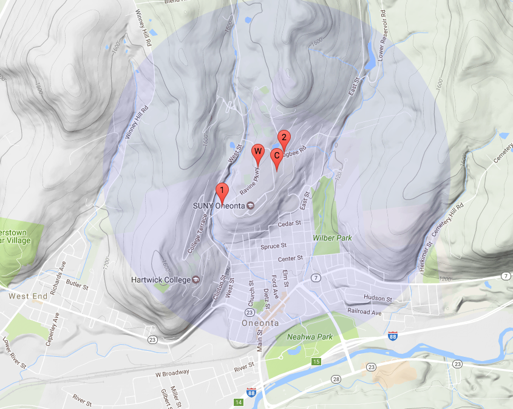
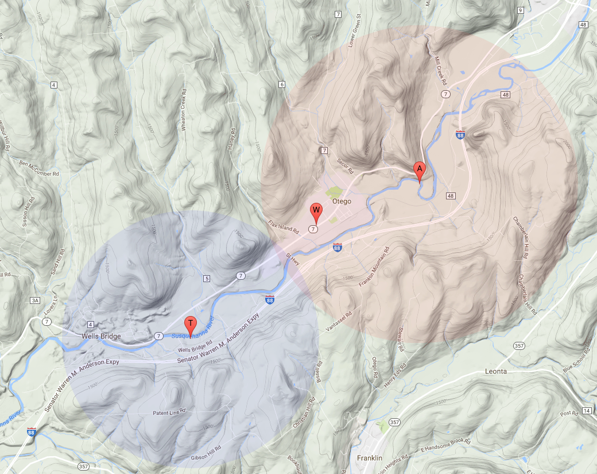
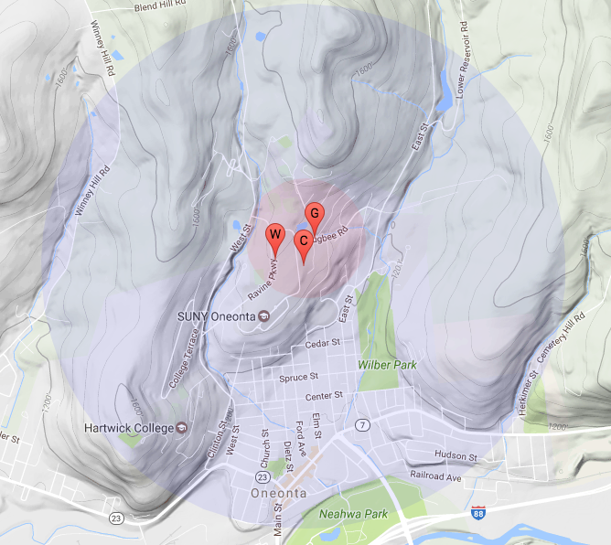

# Locator

The locator is a combination of library and webhook to make it easy to get a location based on Wi-Fi or cellular tower information via the [Google Geolocation API](https://developers.google.com/maps/documentation/geolocation/intro).

This is not a substitute for GPS; it's a mainly a quick and easy way to figure out approximately where you are. You should only expect accuracy within 4000 or so meters, so a couple miles, or what town you're in, not which street you're on. 

In experimental testing, however, it appears to be much more accurate in cities where there are many cellular towers. Also, Wi-Fi locations tend to be very accurate when available, though they are not always available.

## Getting a Google API Key

In order to use the API you will need to get a [Google Location API Key](https://developers.google.com/maps/documentation/geolocation/get-api-key). 

This key is entered into your webhook to authentication your location requests.

## Creating a Webhook

In order to create the webhook you must use the [Particle CLI](https://docs.particle.io/guide/tools-and-features/cli/photon/). You cannot use the graphical webhook creator because this particular webhook requires some special features not available in the graphical UI at this time.

For example, here is my hook.json file. Make sure you update where it says `PASTE_YOUR_GOOGLE_API_KEY_HERE`.

```
{
	"event": "deviceLocator",
	"url": "https://www.googleapis.com/geolocation/v1/geolocate",
	"requestType": "POST",
	"mydevices": true,
	"noDefaults": true,
	"query": {
		"key": "PASTE_YOUR_GOOGLE_API_KEY_HERE"
	},
	"headers": {
		"Content-Type": "application/json"
	},
	"body": "{ {{#c}}\"considerIp\":false,\"radioType\": \"gsm\",\"carrier\": \"{{o}}\",\"cellTowers\":[{{#a}}{\"cellId\":{{i}},\"locationAreaCode\":{{l}},\"mobileCountryCode\":{{c}},\"mobileNetworkCode\":{{n}} },{{/a}}{\"cellId\":{{a.0.i}},\"locationAreaCode\":{{a.0.l}},\"mobileCountryCode\":{{a.0.c}},\"mobileNetworkCode\":{{a.0.n}} }]{{/c}}{{#w}}\"considerIp\":{{i}},\"wifiAccessPoints\":[{{#a}}{\"macAddress\":\"{{m}}\",\"signalStrength\":{{s}},\"channel\":{{c}} },{{/a}}{\"macAddress\":\"{{a.0.m}}\",\"signalStrength\":{{a.0.s}},\"channel\":{{a.0.c}} }]{{/w}} }",
	"responseTemplate": "{{^error}}{{location.lat}},{{location.lng}},{{accuracy}}{{/error}}{{#error}}{{message}}{{/error}}",
	"responseTopic": "hook-response/{{PARTICLE_EVENT_NAME}}/{{PARTICLE_DEVICE_ID}}"
}
```

To create the webhook with the CLI:

```
particle webhook create hook.json
```


## Writing Photon Firmware

The easiest way to get started is to use Particle Build or Particle Dev and select the **locator** library from the community library and use the provided example. It looks like this:

```
#include "Particle.h"
#include "locator.h"

SerialLogHandler logHandler;
Locator locator;

SYSTEM_THREAD(ENABLED);


void setup() {
	Serial.begin(9600);
	locator.withLocateOnce();
}


void loop() {
	locator.loop();
}

```

That program works on both the Electron and Photon (and P1) 

To have it post the location periodically, use the withLocatePeriodic method instead, and pass in the number of seconds between location attempts. (120 = 120 seconds or 2 minutes.)

```
locator.withLocatePeriodic(120);
```

To have it test the location manually specify neither Once nor Periodic, and call:

```
locator.publishLocation();
```


## Testing

Viewing the Event Log in the [Particle Console](https://console.particle.io) is the easiest way to watch the code in action.

The *deviceLocator* event contains the information about the tower(s) where you currently are located. For example:

```
{"c":{"o":"AT&T","a":[{"i":145074049,"l":11511,"c":310,"n":410}]}
```

Then you'll see a *hook-sent/deviceLocator* event. The data is always *undefined*; that is the normal behavior.

Finally, you should hopefully get `hook-response/deviceLocator` event with something like:

```
42.344152799999996,-75.2582815,4127
```

That's the latitude and longitude in degrees and a circle of uncertainty radius in meters.


## Examples

Here are some examples. I was driving and not all of the measurements were taken at the same time, but it provides a good overview of the accuracy.

### Example 1



In this map, point 1 and point 2 are GPS locations taken at different times.

Point W is a Wi-Fi location, which tends to be quite accurate.

Point C is a cellular location, which was accurate but the circle of uncertainty (blue) is large.

### Example 2



Point T and the blue circle of uncertainty is a cellular location from T-Mobile using 2G.

Point W is a Wi-Fi location.

Point A and the red circle of uncertainty is the cellular location from AT&T using 3G. 

I was driving east on Highway 7, so some of the difference in locations may be due to actually being in different locations.


## Using Locator vs. CellLocate

The u-blox cellular modem in the Electron also has a feature known as CellLocate that sometimes has better accuracy. The main problem with CellLocate is that it takes a long time to determine the location, 10 seconds or more. And, of course, it only works with cellular devices.

Also, in my unscientific test of driving around, I found CellLocate was able to determine a location less often than the Google API.



Point W is a Wi-Fi location.

Point G is a GPS location.

Point C is the location returned by both the Google Geolocation API and the u-blox CellLocate features. Both had nearly identical locations, but the circle of uncertainly is larger for cellular (blue) vs. Cell Locate (red).